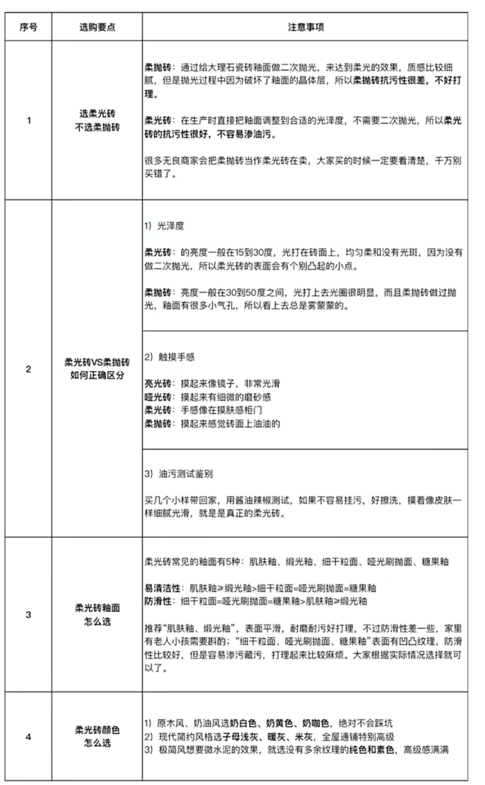

### 地板以及地砖选材
#### 客厅地砖选材
客厅本来是打算和主卧次卧通铺地板，保持原木风(日系)，但是考虑到地板不能长时间沾水(不能拖地)也不好打理，后期维护可能需要费点时间，故选择了柔光砖

- 哑光砖 (反光率太低，本身就小的客厅透光率，显得没光)
- 亮光砖 反光率高，也是很容易打理的，但是网上看到的风格(不用地板原木风(日系))基本都是柔光转，所以放弃了，如果表面有痕迹，很容易就看得到,(采光差可以考虑亮光转)
- 柔光砖 反光率略高于哑光砖，不怎么好打理 (无主灯设计，手感好)
- 柔抛砖 避免踩坑的砖，和柔光砖很类似，但是不利于打扫

