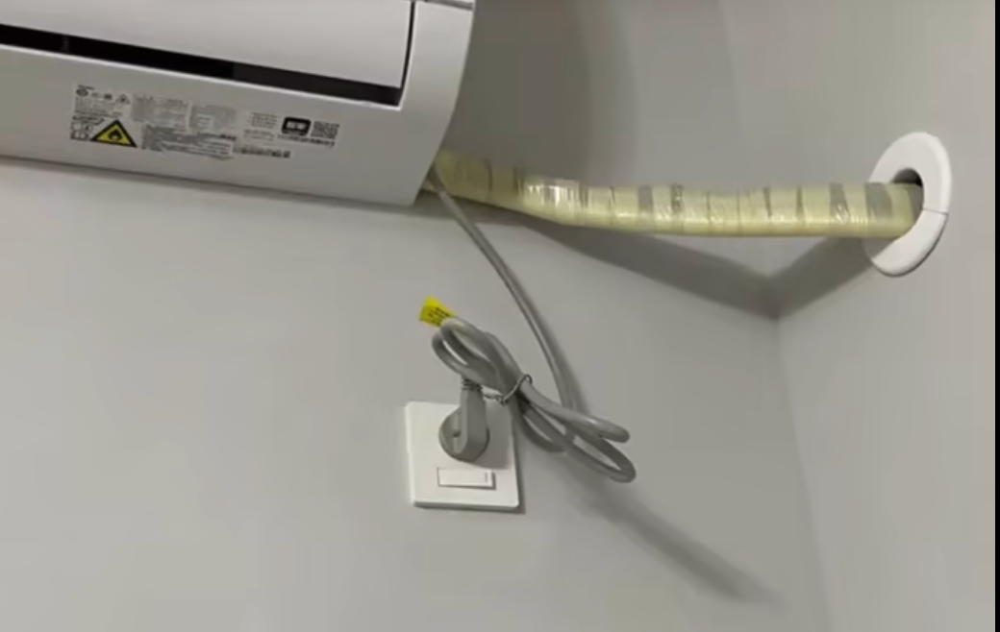

#### 沙发区域插座
沙发两旁/一旁，四孔插座，(type-c功率太小不实用)

#### 轨道插座
小家电区域(餐边柜/厨房) 放置轨道插座

#### 冰箱
单独一路电路控制(防止出远门，远程控制) 
冰箱插座暗装

#### 卫生间镜柜
卫生间镜柜里面可安装两个5孔插座(吹风机/电动牙刷充电) 
智能马桶区域放置防溅罩插座

#### 厨房区
厨房水槽下方安装防溅罩插座

#### 阳台
洗衣区预留 2个6孔插座，一个洗衣机与烘干机，一个是给内衣内裤专用  
另外一侧 预留一个插座 5孔
阳台顶部预留一个插座安插电动晾衣架

#### 主卧/次卧
书桌预留2个五孔插座
